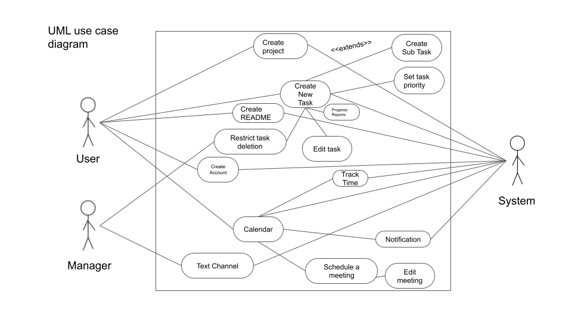

Git link: https://github.com/AcedenD/CMPE131team4.git

-Aden Dang (AcedenD)
-Aishwar Gupta (Aishwar-Gupta)
-Khanh Nguyen (khanhng21)
-Jugad Khajuria (JugadK)

Project Name: Task Managerinator

USE CASES:

1) Create account
2) Schedule Meetings and Events
3) Create Task
4) Set Task Priority 
5) Central Calendar
6) Text Channels
7) Progress Reports 
8) Real Time Notification  
9) Let user set Reminders
10) Let user Assign Tasks to other users
11) Allow for multiple projects
12) Track total time online
13) Restrict task deletion
14) User can split tasks in sub tasks
15) Let users add a README to the project

Use Case 1
--------
# Use Case Description

**Product Name:** Task Managerinator

**Problem Statement:** The project allows users to manage a set of tasks and be able to collaborate and share tasks with other users.

**Use Case Name:** create account

**Date:** 31 March, 2021

 

## Summary

\* User create account, if they don't already have an account

 

## Actors

1. actor 1: new user, first time using the task manager

   

## Preconditions

precond 1: actor 1 doesn't have an account

## Triggers

actor 1 first time open the web page (task manager) a home screen will appear, with some info about the app

 

## Primary Sequence

1. From the home page, actor 1 press on "Login" at the top right corner. 
2. Since the actor doesn't have an account, he will have to press on "Create an account"
3. actor 1 enter in their name, email and password then press sign up

 

## Primary Postconditions

1. After actor 1 press Login link, from the home page, the login page will appear, on the login page there will be a form for the actor to input their info.
2. Since this is the first time actor 1 is using the app, the actor won't be able to sign in cause he doesn't have an account
3. After the actor press on "Create an account", the page will redirect to a sign up page. On that page there will be a form for the actor to input their name, email and password. 
4. After pressing sign up the backend will check if the account (email) already exist in the database; if not then save it into the data base. If account exist then output an error message "Account already exist"
   the page will redirect to the login page

## Alternate Sequences

Step 1: If user decide to read about the app to the very end of  the page, there will be a "Create an account" button at the end, If the user click on that, he will be automatically redirect to the sign up page directly without going through the login page.
Step 2: follow the regular sequence

Use Case 2
--------
**Use Case Name:** Schedule Meetings and Events

**Date:** 1 April, 2021

 

## Summary

Allow users to schedule meetings/ events for a certain projects group

## Actors

1. users, current users/ members of the project
2. System, the back end and front end to handle the data/information

## Preconditions

1. User must have account, sign in and already in a group project

2. User is currently on the home page of the project they want to create a meeting for.

 

## Triggers

When any members of the group want to set up a group meeting/event time, they can add a new event time and date to the group calendar.

## Primary Sequence

1. User will click on an calendar button and user will be redirect to the calendar page.
2. Once user is at the calendar screen, the calendar of the current month of the current year will appear.
3. User will click on the date that they want the event to be on, and a screen will appear. This screen allow the user to pick the time of the event and they can put a note of what that even is for. Some example can be: Group meeting, one on one, etc...

## Primary Postconditions

1. On the project calendar page, a new event appear on the set date. Clicking on it will show the meeting time, the note and who created the event. 
2. User can now click on it again to edit it if they want.

 

## Alternate Sequences

* No alternate sequences

Use Case 3
--------
**Use Case Name:** Create tasks

**Date:** 1 April, 2021

 

## Summary

Allow users to create tasks for a certain projects group

 

## Actors

1. users, current users/ members of the project
2. System, the back end and front end to handle the data/information

 

## Preconditions

1. User must have account, sign in and already in a group project
2. User is currently on the home page of the project

 

## Triggers

When any members of the group want to to create a new task for a certain project.

 

## Primary Sequence

1. User will click on the add task button, and a window will pop up. 

2. On the window, user can name the task, set the due date and add which member the task belong to(if wanted to be specify). 

3. After enter in all the necessary info, the use then press add task that will be at the bottom of the window. 

   

## Primary Postconditions

1. On the project calendar page, a new task card appear in the to do list with the due date at the bottom.
2. Other members of the group can also see it, and they can edit how ever they like.

## Alternate Sequences

* No alternate sequences

Use Case 4
--------

## Use Case Description

**Product Name:** Task Managerinator

**Problem Statement:** The project allows users to manage a set of tasks and be able to collaborate and share tasks with other users.

**Use Case Name:** Set task priority

**Date:** 5 April, 2021

## Summary

User set which task is the priority among all the tasks that were created that main user and other users can see.

## Actors

1. User
2. Systems/ Software

## Preconditions

1. User already created task(s)
2. User is currently on the homepage of the project

## Triggers

1. Update certain task(s) to be priority

## Primary Sequence:

1. User clicks on the setting button which located right next to existing task(s)
2. User clicks on ‘Set task as priority’ which is in setting section

## Primary Postconditions

1. On the homepage, the priority task will be on the top and highlighted in red
2. User can click on the setting button and click on ‘Set task as priority’ again to make it back to normal task

## Alternate Sequences

* No alternate sequence

Use Case 5
--------
## Use Case Description

**Product Name:** Task Managerinator

**Problem Statement:** Shows user their availability and what date and time they are busy.

**Use Case Name:** Central Calendar

**Date:** 5 April, 2021

## Summary

User search for their availability and takes a look at their schedule. They can see when they are available and fill new task in empty spots.

## Actors

1. User
2. Systems/ Software
3. Clock

## Preconditions

1. User already created task(s)
2. User already set certain date and time for task(s)

## Triggers

1. Main user or other users add a new task on the same date and time with an existing task

## Primary Sequence:

1. User clicks on the calendar button to see existing tasks’ date and time, and available time
2. A new page will show up with all the existing tasks that match with date and time on the calendar

## Primary Postconditions

1. User can click on the task on calendar to move or edit it.
2. Primary task(s) will be highlighted as red on the calendar

## Alternate Sequences

* No alternate sequence

Use Case 6
--------
## Use Case Description

**Product Name:** Task Managerinator

**Problem Statement:** The project allows users to manage a set of tasks and be able to collaborate and share tasks with other users.

**Use Case Name:** Text Channels

**Date:** 5 April, 2021

## Summary

User creates channel to send and receive text messages. Each text channel is a way to communicate with a contact or group of contacts.

## Actors

1. Manager
2. Channel’s members
3. Other users
4. Systems/ Software

## Preconditions

1. User has to add other people to the channel as well as knowing other user’s username
2. User is currently on the homepage of the project
3. Other users have to have an account in order to communicate on this platform

## Triggers

1. New message is posted to a specific text channels of specific group of users
2. Only manager and members of the channels can see the channel

## Primary Sequence:

1. User clicks on the ‘channel’ button which located on the homepage
2. User sets name for the channel
3. A window will pop up to ask if user wants to add any user
4. User entered other users’ username and click ‘add’ button
5. A page will popup with a textbox on the bottom for tying the text message
6. User clicks on ‘send’ button next to the textbox to send message

## Primary Postconditions

1. Manager who is the one who created the channel can edit the channel’s name
2. Manager can delete the channel
3. Users will receive notification whenever a new text message is received in the channel

## Alternate Sequences

* No alternate sequence

Use Case 7
--------
## Use Case Description

**Product Name:** Task Managerinator

**Problem Statement:** The project allows users to manage a set of tasks and be able to collaborate and share tasks with other users.

**Use Case Name:** Progress Reports

**Date:** 5 April, 2021

## Summary

User can see the status of the task and see if it is completed or not. User can also add comments on an issue in the task.

## Actors

1. Manager
2. User
3. Systems/ Software

## Preconditions

1. User already created task(s)
2. User has to set the deadlines for the task prior
3. Other users should have access to the task

## Triggers

1. User changes status of a task
2. User marks a task as ‘complete’ or ‘in progress’ when a new comment is added on an issue

## Primary Sequence:

1. User clicks on the setting button which located right next to existing task(s)
2. User clicks on ‘Update task’ which is in setting section
3. User clicks on either ‘In progress’ or ‘Completed’ button to update the status of a task
4. User clicks on ‘Add comments’ which is in setting section to add comments on the task for others to see and edit.

## Primary Postconditions

1. Every existing task will be marked as ‘Incomplete’ until user update status
2. User can edit comment on an issue

## Alternate Sequences

* No alternate sequence

Use Case 8
--------

## Use Case Description

Product Name: Task Managerinator
Problem Statement: The project allows users to manage a set of tasks and be able to collaborate and share tasks with other users.

Use Case Name: Real-Time notification.
Date: 4 April, 2021

## Summary:

The user should get real-time notifications of deadlines, reminders, and tasks added by their group leader. It should also notify user about tasks completed by other members in the group and Notify users if they are added to a new group project. It will also display the messages sent by other users in the inbox as notifications.

## Actors:

1. Customers/User.
2. Clock.
3. System Software.

## Preconditions:

Precondition 1: The deadlines for the task, the date and time, must be set.
Precondition 2: Group leader must add the task, deadline, and add members working on the task.
Precondition 3: The user must send an invite to other users for collaboration.
Precondition 4: The completed task must be marked done by the worker.
Precondition 5: The user should send the message to be delivered through internal messaging service.

## Triggers:

1. When a deadline for a task is with in 24 hours.
2. When a new task or project is created by the group leader.
3. When deadlines are set/altered for a particular task.
4. When a task is marked as completed.
5. When a user receive an invite to join a group project.
6. When the user receives a private/group message through internal messaging service. 

## Primary Sequence:

1. Step 1: When a message, private/system message, is received in the inbox, push the message as a notification on the systems the user has the account opened.

## Primary Postconditions:

Postcondition 1: It will show the notifications across all devices.
Postcondition 2: The notification would be stored in the inbox within the users account.

## Alternate Sequence:

NO ALTERNATE SEQUENCE FOR THIS TASK SET.

Use Case 9
--------

## Use Case Description

Product Name: Task Managerinator
Problem Statement: The project allows users to manage a set of tasks and be able to collaborate and share tasks with other users.

Use Case Name: Let user set reminders.
Date: 4 April, 2021

## Summary:

The user should be able to set reminders for different tasks assigned by setting date and time as the reminder and receive notification reminders.

## Actors:

1. Customer/User.
2. Clock.
3. System Software.

## Preconditions:

Precondition 1: The date and time for the task should be set.
Precondition 2: The task to be reminded should not be marked as completed.

## Triggers:

1. When the date and time set for a task matches the current time.

## Primary Sequence:

1. Check if the present time matches the date and time of any assigned tasks.
2. Check if the matched task has been completed.
3. If not completed, ring an alarm tone with notification for the user.
4. Add new reminder by checking the time and date to be appropriate - reminder should have a future time. 

## Primary Postconditions:

Postcondition 1: Ring the alarm for 1 minute.
Postcondition 2: Wait for the user response to the alarm - turn off alarm or mark as completed.
Postcondition 3: Look for a different reminder by checking date and time and repeat the process.  

## Alternate Sequence:

NO ALTERNATE SEQUENCE FOR THIS TASK SET.

Use Case 10
--------

## Use Case Description

Product Name: Task Managerinator
Problem Statement: The project allows users to manage a set of tasks and be able to collaborate and share tasks with other users.

Use Case Name: Let user assign tasks to other users.
Date: 4 April, 2021

## Summary:

The user should be able to assign tasks to different users and groups with in the project. Other users should accept the invitation to join the group before the user/admin can set tasks for other members of the group. 

## Actors:

1. Customer/User.
2. Clock.

## Preconditions:

Precondition 1: The user should be the admin of the group or have the permission to change or add tasks.
Precondition 2: Other group members should accept the invitation to collaborate in group.
Precondition 3: The added task should be with in the group project.
Precondition 4: The user/users must be selected to assign the task.

## Triggers:

1. When user with permission adds a new task with other group members.
2. When user with permission changes attributes of a task which has other members working with in a group.

## Primary Sequence:

1. Check if the user has the permission to change or add tasks for other members.
2. Check if the other members are working with in the same group as the task being added or changed.
3. Allow user to add tasks for a group of users or other users as selected.
4. Check if the time and date are correct and do not correspond to a time in the past as a deadline.
5. Set priority for the task to be assigned and requirements to be fullfilled.
6. Set new tasks or change the deadlines/requirements for the preexisting tasks for other users.

## Primary Postconditions:

Postcondition 1: Set, add or change, task in the users dashboard who is assigned the task.
Postcondition 2: Notify user about the added task through notification.
Postcondition 3: Set reminders and priority as assigned by the leader or the user assigning the task.

## Alternate Sequence:

NO ALTERNATE SEQUENCE FOR THIS TASK SET.

Use Case 11
--------

## Use Case Description

Product Name: Task Managerinator
Problem Statement: The project allows users to manage a set of tasks and be able to collaborate and share tasks with other users.

Use Case Name: Allow for multiple projects.
Date: 4 April, 2021

## Summary:

The user should be able to work on multiple different projects by setting separate reminders and deadlines. The projects can be personal or group projects and multiple projects can have the same deadline.

## Actors:

1. Customer/User.
2. Clock.
3. System Software.

## Preconditions:

Precondition 1: There should be atleast one non-empty project pre-defined. 
Precondition 2: There user should be logged in to create new projects.

## Triggers:

1. The user wants to create or work on multiple projects at the same time.
2. The user tries to create a new project when there are other predefined projects and tasks.
3. The user want to work on multiple group projects with a team.

## Primary Sequence:

1. The user creates a new project and sets Agile or Waterfall model to be implemented.
2. The user schedules tasks with deadlines and meetings.
3. System check if the date and time are valid and adds the new tasks to calendar.
4. The user enters the priority for each task.
5. The user can add more members to the project and send invitation to collaborate to other users.
6. The users sets permission level for other added members.
7. The user assigns tasks to other members as the project creator is the admin by default.

## Primary Postconditions:

Postcondition 1: Set new dates and times for newly added projects.
Postcondition 2: Set reminders for the new tasks within the new projects.
Postcondition 3: Send notification about the created project to its members.
Postcondition 4: Create a new tab on the dashboard with the new project.
Postcondition 5: Set priority accordingly as compared to other projects and their tasks.
Postcondition 6: Set deadlines on the central calendar with scheduled meetings and events.
Postcondition 7: Assign the tasks to others and generate progress reports.
Postcondition 8: Set Agile or Waterfall plans for the project.
Postcondition 9: Disable task deletion for members without permission.

## Alternate Sequence:

NO ALTERNATE SEQUENCE FOR THIS TASK SET.

Use Case 12
--------

# Use Case Description

Product Name: Task Managerinator

Problem Statement: The project allows users to manage a set of tasks and be able to collaborate and share tasks with other users.

**Use Case Name: Track total time online **

Date: 4 April, 2021

## Summary

    The software will track the total amount of time the user is logged in on the application, this will then be shown to the users a total number and as a graph that is broken down into what day of the week they were spent

## Actors

1. Software    
2. User

## Preconditions

1. User can create an account

## Triggers

1. When user logs in

## Primary Sequence

1. User Logs in
    
2. Software begins tracking how long they are logged in till they log off

## Primary Postconditions

1. total time spent logged in is saved by the software to that User

* A graph is made showing the user their usage across the week

Use Case 13
--------

*Product Name:* Task Managerinator

Problem Statement: The project allows users to manage a set of tasks and be able to collaborate and share tasks with other users.

*Use Case Name:* Restrict Task Deletion

*Date:* 4 April, 2021

## Summary

    Deleting or comleting a task should be restricted to caertain users who have the correct permissions in order to make sure not anyone can set a task as done or deleted, making things easier to manage

## Actors

1. System

## Preconditions

1. users have accounts

2. projects are working

3. tasks can be created

## Triggers

1. when user tries to delete or complete a task

## Primary Sequence

1.  User clicks on task

2. user clicks on a button to delete tasks

3. it works depending on whether the user has the right permissions

## Primary Postconditions

1. Task still exists or is deleted depending on if the user has the right permissions

Use Case 14
--------

# Use Case Description

Product Name: Task Managerinator

Problem Statement: The project allows users to manage a set of tasks and be able to collaborate and share tasks with other users.

**Use Case Name: User can split tasks in subtasks

Date: 4 April, 2021

## Summary

A task can be further split into sub tasks that can be assigned to users

## Actors

1. Software
2. User

## Preconditions

1. User can create an account
2. Users can create tasks

## Triggers

1. When a user tries to create subtasks
2. When a user creates a task

## Primary Sequence

1. User creates task
    
## Triggers

1. When user logs in

## Primary Sequence

1. User Logs in
2. Software begins tracking how long they are logged in till they log off

## Primary Postconditions

1.total time spent logged in is saved by the software to that User
2. A graph is made showing the user their usage across the week

Use Case 15
--------

# Use Case Description

Product Name: Task Managerinator

Problem Statement: The project allows users to manage a set of tasks and be able to collaborate and share tasks with other users.

**Use Case Name: Let users add a README

Date: 4 April, 2021

## Summary

1. users can edit and create a README in order to tell other users of certain details that they might not be aware of about the project

## Actors

1. User

## Preconditions
1. User can create an account
2. User can create a project

## Triggers
1. User clicks a button to create a README

## Primary Sequence:

1. User clicks a button to create a README
2. user can now write the README
3. user saves the README

## Primary Postconditions:

1. All users of the project can now see the README

##NON-FUNCTIONAL REQUIREMENTS:

1. The system shall be available 24 hours/day and be able to upgrade while it is running.
2. System shall authenticate the user to maintain security and privacy.
3. System shall display 10 tasks per page and download files within five seconds.
    

